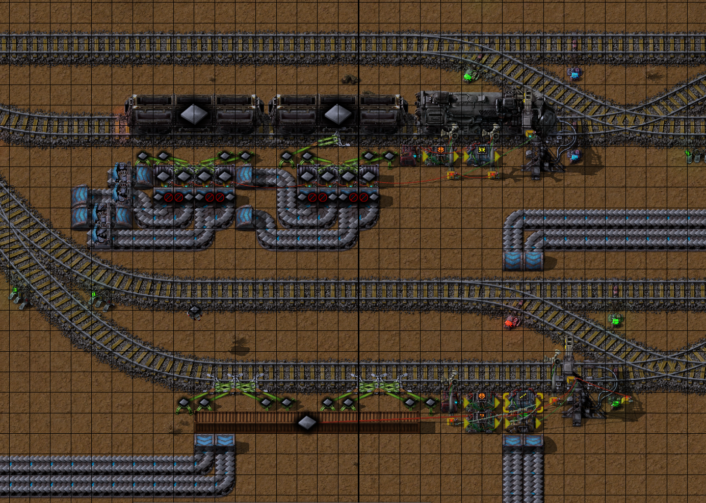
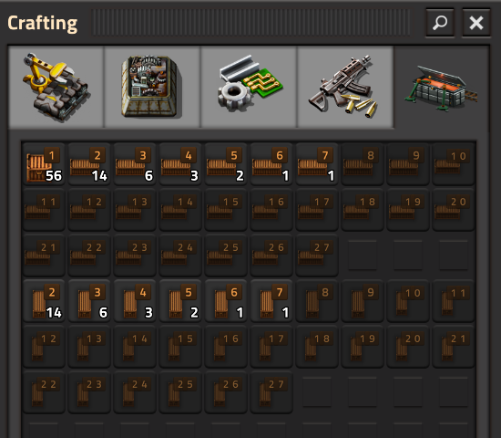
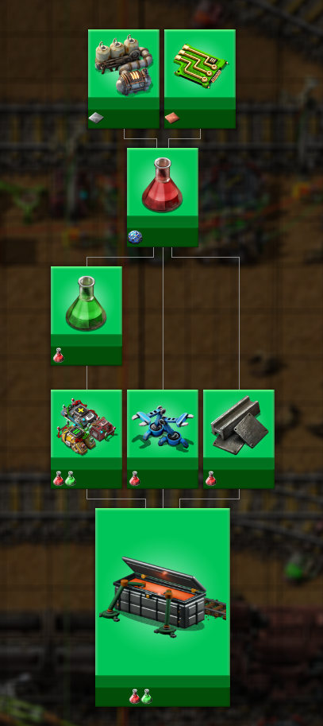
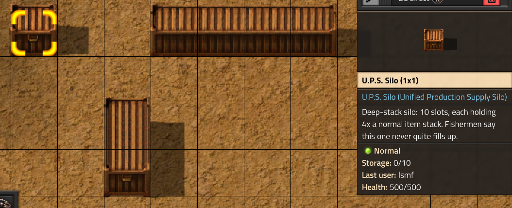

# Unified Production Supply Silos

A wide (or tall) buffer chest for train-loading stations, built for megabases with many rail stations - hundreds if not thousands - where UPS is the metric that matters and functionality is already a solved problem.

## Screenshots

Two unloader stations side by side, vanilla steel chests on top and a single long buffer chest on the bottom - replacing what would otherwise be 8 steel chests and their splitter/inserter cascade.

Stack size per slot scales with the silo's size - larger silos hold proportionally more per slot, not more slots.

The crafting chain leading up to the silo.

A 1x1, 1x2, and 4x1 silo up close. Ten slots, each holding several stacks worth.

## Why

Vanilla has no path to a bigger chest at all - steel-chest is the ceiling. A few great community mods fill that gap by merging chests into a wider one, but the ones I looked at give a bigger chest more slots as it grows, and slot count is what actually costs UPS to simulate - so the wide chest itself becomes the new bottleneck at scale.

This mod takes a different route: a fixed, small slot count (10) with the *stack size per slot* multiplied instead, using Factorio 2.0's `inventory_type = "with_custom_stack_size"`. A 20-tile-wide silo has the same 10 slots as a 2-tile one - it just holds proportionally more per slot. A single circuit wire on the entity reads the whole contents efficiently.

Further, the mod provides reliable blueprinting, something the otherwise mighty bulk rail loaders seem to struggle with. I would have happily kept using them and skipped writing my own - but blueprint/copy-paste stamping their stations was (systematically?) unreliable. Sometimes a paste would place cleanly, sometimes it wouldn't. A theory is contention/races around the hidden inserters/loaders they build alongside the visible entities, but that's speculation. Either way, this mod places single physical entities with nothing hidden to construct alongside it - blueprinting is just normal entity placement and should be very robust.

## Credits

[WideChests](https://mods.factorio.com/mod/WideChests) is the mod this one's wide/tall chest artwork was copied from and rendering approach was worked out from (slicing cap/middle art into repeating tile segments) - genuinely appreciate the reference. [Modular Chests](https://mods.factorio.com/mod/LB-Modular-Chests), [Bulk Rail Loader (Continued)](https://mods.factorio.com/mod/railloader-MXO), and [Modern Bulk Rail Loaders: Pooled](https://mods.factorio.com/mod/modern-bulk-rail-loader-pooled) all tackle the same real problem from their own angles, and are worth a look depending on what you need. And thanks to AI of course - who wrote a lot of this - hallucinated APIs and all.

## Known limitations

Containers can't rotate their collision box in Factorio's engine, so horizontal and vertical are separate items/recipes/entities rather than one item you rotate. Two consequences follow from that: 1) building requires holding the correctly rotated item in the inventory instead of just rotating one like any other item. 2) Blueprints containing this chest can only be rotated 180 deg or mirrored (both come out correct) - a genuine 90/270 deg rotation doesn't work, since that would require the entity itself to swap from wide to tall, which Factorio's engine won't do automatically.
